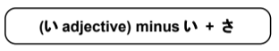
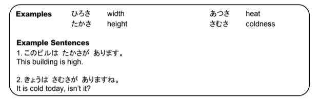

# Turning adjectives into attributes

Attributes can be made out of most of the い-adjectives by dropping the い and adding さ

Once you have created the attribute, you can use it just as you would use any noun in a sentence to say things like, `The length is two feet.`

> Examples:

