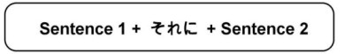

# Connecting sentences using それに

## Meaning

それに can mean `and in addition` or `and is also` depending on the context.

## Usage

それに is used to connect two sentences. It is placed at the beginning of the second sentence.

!!! example "Examples"
    - `渡辺さんは優しい。それに、おもしろいです　→　Mr./Ms. Watanabe is kind. And also, he/she is interesting.`
    - `日本は人がおおいです。それに、来るまもおおいです　→　Japan has many people. And in addition there are many cars too.`