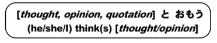

# とおもう (to think)

In sentences using おもう, the phrase that makes up the thought must be in informal form. Even です should be conjugated to だ.

> Examples:

### Adjectives

In sentences where an adjective exists, です is removed from the sentence.

!!! example
    これはおいしいとおもいます　→　I think this tates good.