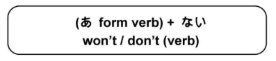

# Informal Verb Negatives

## う-Verb (Negative-Past)

The あ form + ない is used to make the present / future negative form for regular verbs.

!!! example "Examples"
    - すわる　→　すわ**らない**
    - うたう　→　うた**わない**
    - あるく　→　ある**かない**
    - はなす　→　はな**さない**
    - うつ　→　う**たない**
    - しぬ　→　し**なない**
    - とぶ　→　と**ばない**
    - やすむ　→　やす**まない**
    - およぐ　→　およ**がない**

    #### Exceptions:
    - ある　→　**ない**

## る-Verb (Negative-Past)

In order to form the negative past form of る-Verbs, you will need to remove the る, and then follow it with the auxiliary verb ない (or ます), conjugated into their past forms. This will either be なかった.

!!! example "Examples"
    - 食べる　→　食べなかった
    - 見る　→　見なかった
    - ねる　→　ねなかった