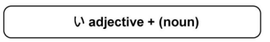
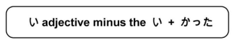

# い Adjectives

い adjectives all have one thing in common: they all end in `い`

!!! failure "Important"
    - い adjectives will always have the `い` outside of the kanji. If the い is inside the kanji, it is not an い adjective.
    - い adjectives must never be followed by `だ`. This is due to だ only being able to conjugate with nouns (which な-Adjectives originally are)

## Modifying い Adjectives

To modify a word, they are simply placed in front of it



!!! example "Examples"
    - `たかいｋるま　→　an expensive car`
    - `おもしろいテレビ　→　an interesting TV`
    - `あかいりんご　→　a red apple`
    - `ちいさい猫　→　a small cat`
    - `おいしいピザ　→　delicious pizza`

## い Adjectives Polite Form

い adjectives can be made into the polite form by simply adding `です` to the end.

!!! example "Examples"
    - `あついです　→　hot`
    - `きょうは、あついです　→　It's hot today.`

## い Adjectives Causal Form

い adjectives can be made into the casual form by simply removing the `です` at the end.

!!! example "Examples"
    - `あつい　→　hot`
    - `きょうは、あつい　→　It's hot today.`

## Making い Adjectives Past Tense

い adjectives can be made into past tense by taking the い off the end and adding `かった`. This works for the negative and positive forms of the adjective



!!! example "Examples"
    ```
    あたらしい　→　new
    あたらしかった　→　was new

    あたらしくない　→　not new
    あたらしくなかった　→　was not new
    ```

## い Adjectives Negative Form

い adjectives can be made into the negative form by taking the い off the end and adding `くない`

!!! example "Examples"
    - `あつくないです　→　not hot`
    - `きょうは、あつくないです　→　It's not hot today.`

