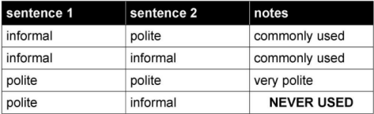

# Connecting Sentences using から

## Things To Know

1. **Sentence 1** is always the `REASON` and **sentence 2** is the `RESULT`
2. **Sentence 1** is better sounding as casual form. The politeness of the sentece is determined by **sentence 2**.

> Example 1:

> Example 2:

## Which verb form to use with から sentences

It sounds more natural for the verb in **sentence 1** to be informal. The formality of the entire sentence is decided by the verb in **sentence 2**

However, you _**can**_ use different forms. Here is a list of the combinations allowed when creating から statements:

!!! failure "Important"
    You can never have a formal verb in **sentence 1** and then an informal verb in **sentence 2**

There is an easy way to remeber the patterns that are allowed. You can go across the politeness (informal → informal) or (polite → polite). You can also go up in politeness (informal → polite). But you can never go down (polite → informal). _**Never go down.**_ That is the shortcut.

!!! example "Example Sentences"
    In English, we switch between "so", "since", or "because" depending on how you want the sentence to sound. However, the Japanese sentence remains the same regardless of which one is used. 

    - 友達がいないから、さびしいです　→　I am lonely because I don't have any friends.
    - 明日東京に行くから、今日スーツケースをかいます　→　I am going to Tokyo tomorrow, so I will buy a suitcase

## What happens with です?

What happens with です depends on what is directly before the です. If **sentence 1** ends with an い adjective (any tense), the です is **removed**.

> Example:

If **sentence 1** ends with a な adjective **or** a noun then です changes to the informal form of です, which is **だ**

> Examples:

