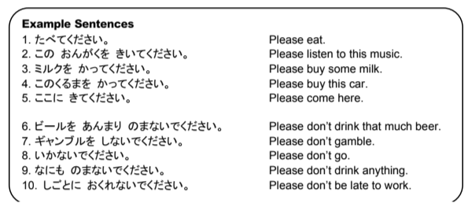

# Making things polite with ください

By adding ください after the て forms, you make things sound nice by adding please. The same particle and sentence structure rules of other verb forms are applied when using the て form.

