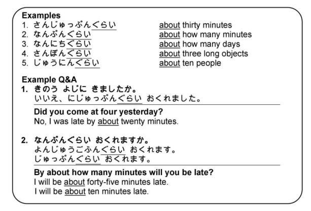

# Making specific amounts less specific with ぐらい

くらい or ぐらい (more common in spoken Japanese) means 'about'; however, it is used with **amounts** and **time durations**. It can be used to make any exact amount less specific.

> Examples:

