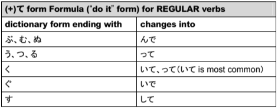
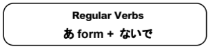
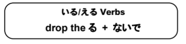
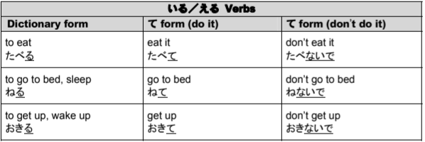
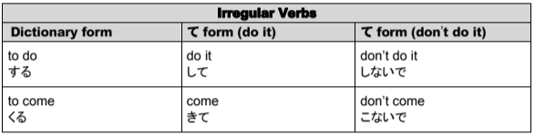
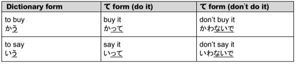

# て Form

## Changing verbs with the て form

Conjugating verbs into the て form is based on the ending hiragana of the dictionary form of the verb. The て form formula is only used for regular verbs, since for いる/える verbs, you simply switch the last る to a て.

### Changing verbs into the positive て form (the "do it" form)

Most of the time, verbs ending in く change to いて. For example, 書く (to write) changes to 書いて. One of the exceptions is 行く (to go), which changes to 行って.

### Changing verbs into the negative て form (the "don't do it" form)

This is the pattern to use when making the "don't do it form":

  

  

### Regular Verb Examples

!!! example "Regular Verb Examples"
    

### いる/える Verb Examples

!!! example "いる/える Verb Examples"
    

### Irregular Verbs

The irregular verbs する and くる do not follow any pattern that you know to conjugate them into the て form.

### Verbs that end in う

When the dictionary form actually ends with an う, the う changes to a わ and then ないで is added to it when creating the negative て form.

!!! example "Verbs ending in う examples"
    