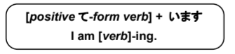
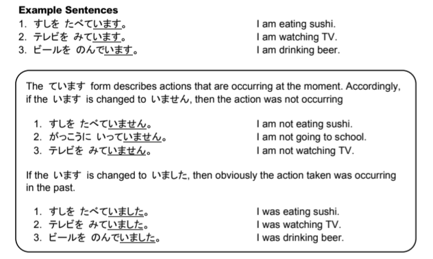
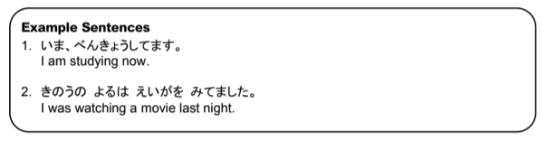

# ている Form

## The ています verb form

The ています form is the verb + -ing form in English. It is used when an action is currently taking place or is ongoing. The ています form of a verb is made by adding います after the positive て-form of the verb.

> Examples:

## ています vs. てます

In spoken Japanese, people often drop the い sound in the ています verb form. Typically this shouldn't be done when writing, but when speaking it sounds more relaxed and casual.

