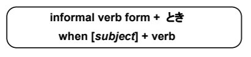
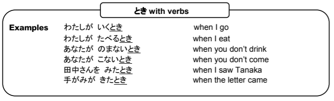
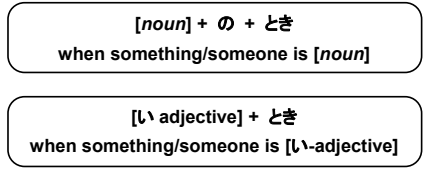
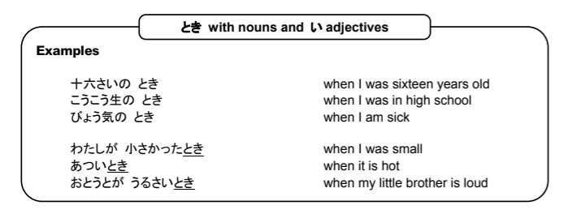
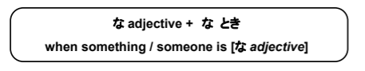
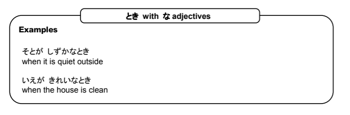

# とき

## Using とき to say "when"

とき can be used in several ways to describe a situation. It can come after verbs and adjectives, and can be linked to other words using the の particle. When used with verbs, the verb tense doesn't matter, but the verb must be in the dictionary form. If you are talking about a specific time, then the time marker に is used after とき.

> Examples

## Using とき with nouns and い adjectives

You can also use とき to say a phrase like, "When I was a child," こどものとき. Notice that there are no verbs in this phraase. It can also be used with な and い adjectives.

> Examples

## Using とき with な adjectives

When you use とき with な adjectives, you must have the な before the とき

> Examples

