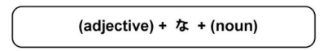

# な Adjectives

## Modifying な Adjectives

な adjectives must have な after them when directly modifying. They cannot be used to modify unless な comes after them.

!!! example "Examples"
    - `きらいなくるま　→　a clean car`
    - `べんりなみせ　→　a convenient store`

## な Adjectives Polite Form

な adjectives can be made into the polite form by simply adding `です` to the end.

!!! example "Examples"
    - `しずかです　→　quiet`
    - `きょうは、しずかです　→　It's quiet today.`

## な Adjectives Causal Form

な adjectives can be made into the casual form by simply removing the `です` at the end and replacing it with `だ`

!!! example
    - `しずかだ　→　It's quiet.`

## Making な Adjectives Past Tense

な adjectives can be made into past tense by adding `でした` at the end.

!!! example
    - `しずかでした　→　It was quiet.`
    

## な Adjectives Negative Form

な adjectives can be made into the negative form by adding `ではありません`

!!! example "Examples"
    - `しずかではありません　→　not quiet`
    - `きょうは、しずかではありません　→　It's not quiet today.`