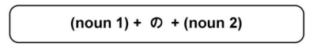
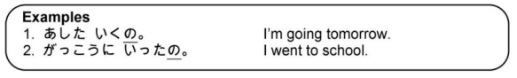

# の Particle

### Noun Connector

の can be used to connect two nouns. A noun that has been changed into an adjectived using の is considered a の adjective. A noun cannot describe or modify another noun unless の comes after it.

!!! example
    - `大学の先生 → a college professor`

### Possessive Connector

の can be used to indicate possession

!!! example
    - `あれは私のぺんです → That over there is my pen.`

### Of

の can also mean **_of_**

### Question marker の

This の acts as the か question marker. It's placed after informal verb forms to make a question.

!!! note
    The informal form is almost never used in written form. It's used in informal conversattions (with close friends, family). It should never be used when speaking to someone considered to be of higher social status than the speaker (boss, teacher, etc.).

!!! example "Examples"
    - 東京に行きの？　→　Will you go to Tokyo?
    - 日本にいったの？　→　Did you go to Japan?
    - いえに帰ったの？　→　Did you return home?

### Using の to create emphasis

When a sentence (not a question) ends in の, and without an updard intonation, it will tend to have more emotion or emphasis. 

!!! failure "Important"
    It's NOT normal for men to use の unless it's a question. Men's response to an informal question with の would end with よ or with just the informal verb

> Examples:

