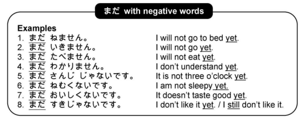
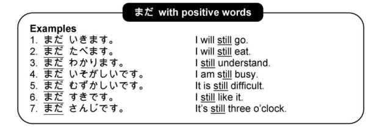

# まだ

## まだ Meaning

`まだ` means 'not yet' or 'still'.

## まだ Usage

まだ can be used with positive or negative adjectives and verbs. Generally, but not always, whene まだ is used with negative words, it means 'yet'. When it is used with positive words, it means 'still'.

