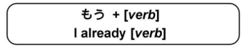
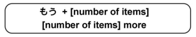
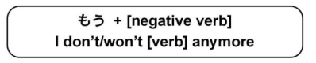

# もう

The meaning of もう changes depending on usage.

#### もう means 'already' when placed in front of the positive past tens verbs (た form):

!!! example "Examples"
    - `もういきました → I already went there.`
    - `もう食べました -> I already ate it.`
    - `もうのみました -> I already drank it.`
    - `もう読みました -> I already read it.`

#### もう also means "already" in front of time related words:

!!! example "Examples"
    - `もうなつです -> it's summer already.`
    - `もうさんじです -> It's already three o' clock.`

#### もう can also mean "more" when placed in front of number words:

!!! example "Examples"
    - `もう一つ -> one more`
    - `もう三人 -> three more people`

#### もう means "anymore" when placed in front of negative verbs:

!!! example "Examples"
    - `もういきません -> I don't want to go anymore.`
    - `もうたべません -> I'm not going to eat anymore.`
    - `もうのみまっせん -> I don't drink anymore.`
  
#### もう can also be used with other words with じゃない after them. In this case, もう means "anymore"

!!! example "Examples"
    - `もうこどもじゃないです -> I'm not a child anymore.`
    - `もう私のともだちじゃないです -> They aren't my friends anymore.`