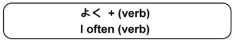

# よく

#### よく Meaning

`よく` means "often" and is placed in front of __positive__ verbs.

!!! example "Examples"
    - `よく東京に行きます` → `I often go to Tokyo.`
    - `よくバナナを食べますか` → `Do you often eat bananas?`
    - `私はよく日本に帰ります` → `I often return to Japan.`