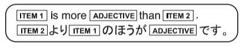
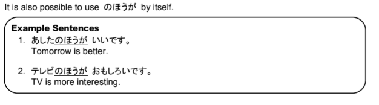

# This is better than that

Depending on the context, より can mean "than, more, than or instead of"

Used to say one item is better, newer, older, bigger, more liked, etc. than another item.

## の方が

