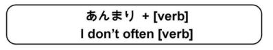

# あんまり

Previously, I learned that `あんまり` means 'not that much.'. It also means 'not that often' and is used with negative verbs. You can almost think of `あんまり` as the opposite of `よく`

!!! info "Examples"
    - `あんまり東京に行きます` → `I don't go to Tokyo often.`
    - `あんまりバナナを食べます` → `I don't eat bananas often.`