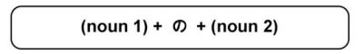

# の Particle

### Noun Connector

の can be used to connect two nouns. A noun that has been changed into an adjectived using の is considered a の adjective. A noun cannot describe or modify another noun unless の comes after it.

!!! example
    - `大学の先生 → a college professor`

### Possessive Connector

の can be used to indicate possession

!!! example
    - `あれは私のぺんです → That over there is my pen.`

### Of

の can also mean **_of_**

