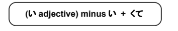
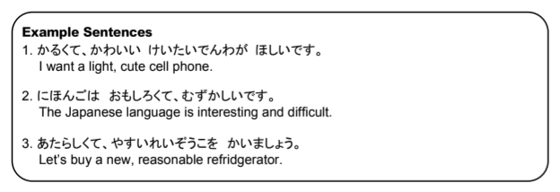

# Stringing い adjectives in a row

In English, if we want to say "little, white car," we just simply string the adjectives in a row and it works. In Japanese, the adjectives must be changed into what we will call the くて form. The い is dropped and くて is added. Every adjective in the row must be in the くて form _except_ for the very last one, which should be normal.

> Examples:

