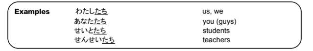

# Plurals in Japanese with たち

There are plurals that are made using たち after certain words. たち is normally used with people and is only used with non-living things when they're being given human characteristics like 星たちが母絵見ました (stars smiled). The most common plurals:

## たち after names

When たち comes after a name, as in 田中さんたち, it means that 田中 is part of a group and he/she is being used to describe that group or is a representative of that group.