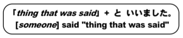
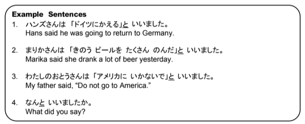
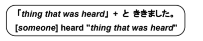
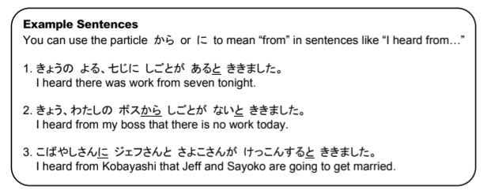
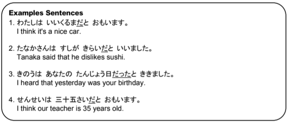

# と Particle

## Uses

The と particle can be used to say 'and' as well as 'with'

## And

The 'and' version of と is always used between two words.

!!! example "Examples"
    - `いぬとねこ → dog and cat`
    - `貴方と私 → you and I`
    - `りんごとすし → apples and sushi`

## With

The 'with' version of と is always used after a word, never between.

!!! example "Examples"
    - `田中さんと → with Mr/Mrs. Tanaka`
    - `まりさんはまことさんと帰ります → Mari will return with Makoto.`
    - `僕は小林さんと行きます → I am going with Mr. Kobayashi`

## Thought-, Opinion-, Quotation-marker

This と is unrelated to the 'and' and 'with' meanings of と. We will call it the thought-, opinion-, quotation-marker, for lack of a better name. Anything that is thought or said is marked with と.

!!! failure "Important"
    The と _**must**_ come **_after_** the thought

### The particle と with the verb いう (to say, tell)

When using 「something」 といいます, anything can be inside the quotation marks.

The sentence that is being quoted sounds more natural if the verb in it is changed to its informal version. For example, 行きます should be changed to 行く, and たべました should be changed to たべた

> Examples:

### The particle と with the verb きく

When saying「something」と聞きました, all verbs in the quotations should be used in their informal versions.

> Examples:

### When です ends the sentence being quoted or idea

When the sentence being quoted ends in です, will need to change it to the informal だ. Similiarly, if the sentence ends in でした, it should be changed to the informal だった

> Examples:

