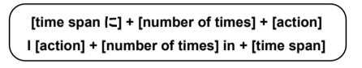

# Event Frequency with に

What 'event frequency' means is how often or how many times an event occurs. The counter for frequency is 回.

You can use event frequency in a sentence with a time span to say how many times something has been done in a certain period of time.

!!! example "Example Q & A"
    **Q**: 貴方は一年に何回アメリカに来ますか　→　How many times a year do you come to America?  
    
    **A1**: 一年に四回行きます　→　I go four times a year
    
    **A2**: 二年に一回行きます　→　I go once every two years

