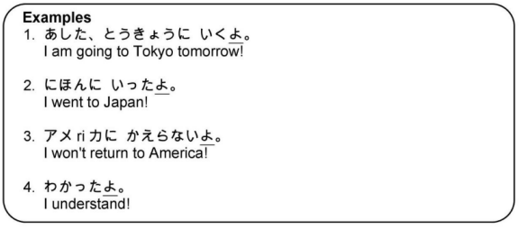

# よ Particle

When a sentence ends with よ it's like adding an exclamation mark. It can be used to convey strong feeling, emotion, and sometimes triumph. It can also be used for emphasis: `I'm certain (of what has just been said).`

!!! note
    In casual conversation, when said in a neutral tone, よ doesn't add any emotion, however, よ can be assertive when used with a stronger tone.

> Examples:

