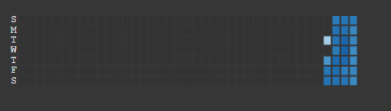
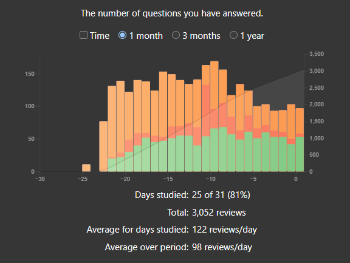

# doc.jp Landing Page

## Anki Stats

!!! failure "Important"
    These are not updated every day so they aren't always accurate. I want to eventually write a script that will handle this dynamically, but for now, screenshots will suffice.

    **Updated Every Monday**

## Daily Activity

{ align=center }

## Card Counts

{ align=center }

## Reviews for 1 month

{ align=center }
