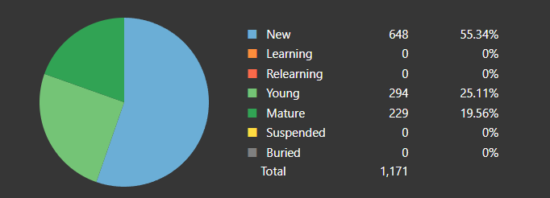

# doc.jp Landing Page

## Anki Stats

At some point, I do plan on scripting this out. But for now, I'll just update it daily.

### Card Counts

!!! info "Current Daily New Card Count"
    Will do **15 cards** a day for now. Might do 20 in the future, but 15 seems like a sweet spot for me.

#### Tango N5 as of _10/14/2023_ 

**508** Vocabulary words known with 663 new cards remaining: On track to finish all new cards on **_November 29th_** with my current daily card amount.

{ align=center }

!!! info "End dates with various daily card amounts"
    > "End date" refers to the day where I have no **new** cards. I will still review after this period.

    As I was curious, here are the end dates with different daily new card amounts:
    
    - **10 New Cards Daily**: _December 23rd_
    - **15 New Cards Daily**: _November 29th_ → _My current planned end date_
    - **20 New Cards Daily**: _November 18th_

## Things I need to work on currently

- と quotation
- とおもう (to think)

## JFZ Book 3 Lesson Page Numbers (No Directory on kindle)

- Lesson 1:
    - Starts: 9
    - Workbook: 21
- Lesson 2:
    - Starts: 49
    - Workbook: 52
- Lesson 3:
    - Starts: 53
    - Workbook: 63
- Lesson 4:
    - Starts: 75
    - Workbook: 84
- Lesson 5:
    - Starts: 97
    - Workbook: 105
- Lesson 6:
    - Starts: 117
    - Workbook: 127
- Lesson 7:
    - Starts: 141
    - Workbook: 148
- Lesson 8:
    - Starts: 159
    - Workbook: 167
- Lesson 9:
    - Starts: 177
    - Workbook: 187
- Lesson 10:
    - Starts: 201
    - Workbook: 209
- Lesson 11:
    - Starts: 219
    - Workbook: 228
- Lesson 12:
    - Starts: 239
    - Workbook: 246
- Lesson 13:
    - Starts: 257
    - Workbook: 266